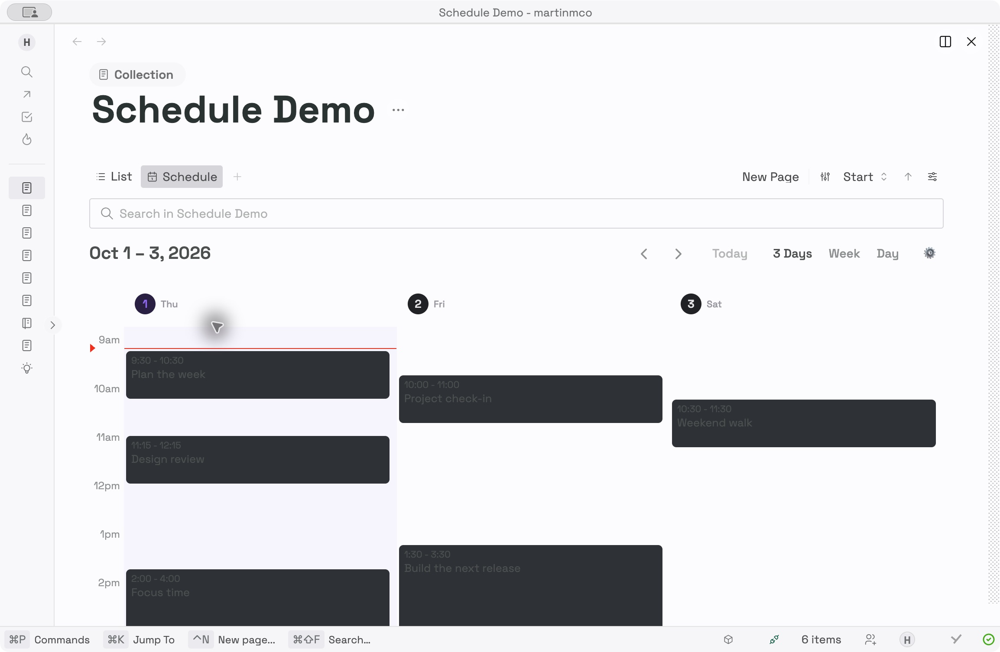

# Thymer Schedule

**Plan time alongside the notes and records already in Thymer.** Schedule adds an opt-in calendar view to an ordinary [Thymer](https://thymer.com) Collection, so you can see and edit timed events without moving them into another app.



[What it does](#what-it-does) · [Quick start](#quick-start) · [Settings](#settings-and-behavior) · [Compatibility](#compatibility-and-limits) · [For developers](#for-developers)

## What it does

- **Choose the view that fits the work.** Switch between Day, Week, and a custom span of 1–14 days. The custom span starts at three days; Week starts Monday.
- **See the useful hours.** Set the visible time range for each Collection. It starts at 9am–6pm and stretches to the available screen height when possible. Today is accented and weekends are shaded.
- **Plan directly on the calendar.** Create, move, and resize timed events in 15-minute steps. Each event is a real Thymer Record with editable Start and End fields.
- **Add it only where you want it.** A global installer adds Schedule to a selected eligible Collection when you run its command. Other Collections stay as they are.

Schedule uses [FullCalendar](https://fullcalendar.io) inside Thymer's custom Collection view. [v0.1.0](https://github.com/martinmco/thymer-schedule/releases/tag/v0.1.0) is the first public release.

## Quick start

1. In Thymer, create a **new global plugin** named “Schedule (add when needed)” and save the plugin container.
2. Paste [installer/dist/plugin.js](installer/dist/plugin.js) into its Custom Code field and [installer/plugin.json](installer/plugin.json) into Configuration, then save both. The [v0.1.0 release](https://github.com/martinmco/thymer-schedule/releases/tag/v0.1.0) provides these as separately named download assets.
3. Open a Collection and run **Schedule: add to current Collection** from Thymer's command palette. **Schedule: choose a Collection…** opens a picker with availability and skip reasons.

## Settings and behavior

Use the gear in Schedule to set the visible hours and custom day count for that Collection. Right-click the day-span button to change the count there too. Schedule saves these settings in the Collection view. It remembers the selected Day, Week, or custom mode and the viewed date locally on each device.

Day uses a centered 640px calendar. Week and custom days use the available Collection width. The time grid grows to fit the window when possible and scrolls when the range or window height needs it. Records without a Start date are not shown in the calendar.

## Compatibility and limits

The global plugin changes no Collection until you choose one. On a fresh eligible Collection it adds editable Start and End fields, a Schedule view, and the Collection plugin code. It reads back the code, view, mapping, and fields after saving. Running the command again is a no-op. If the Schedule view was removed but recognized Schedule code remains, the command restores the view without replacing the code.

Thymer has one Collection plugin code slot. If a Collection already has unrelated custom code, the installer reports **merge required** and leaves it alone. Journal uses a different core plugin and is skipped. A custom view cannot be registered once globally for every Collection through the current SDK. The installer does not automatically attach Schedule to future Collections; use the command when needed.

**Existing installations:** The v0.1 installer recognizes the bundled view code and known earlier Schedule bundles. It reports an already-installed view as ready when the code and editable field mapping agree. Updating Schedule code in an existing Collection is a separate, manual operation in v0.1; back up that Collection's code and configuration first. The installer does not silently replace it.

## For developers

```sh
npm ci
npm test
npm run build
```

`plugin.js` is the Collection view source. `dist/plugin.js` is its unminified pasteable bundle, and `dist/plugin.min.js` is embedded in the global installer. `installer/plugin.js` is the installer source; `installer/dist/plugin.js` is the pasteable global plugin. Bundles are committed so installation does not require Node.js. Build scripts include this project's MIT license and FullCalendar's MIT notice in the generated view code; see [THIRD_PARTY_NOTICES.md](THIRD_PARTY_NOTICES.md).

The project layout is:

| Path | Purpose |
| --- | --- |
| `plugin.js` | Collection view source |
| `installer/plugin.js` and `installer/plugin.json` | Opt-in global installer source and configuration |
| `dist/` and `installer/dist/` | Pasteable generated bundles |
| `test/` | Focused installer tests |
| `PLAN.md` | Current status and next work |

After changing source, run `npm run build` and `npm test`, then commit any changed bundles with the source. CI repeats the build and checks that generated files match. `"private": true` in `package.json` prevents accidental npm publication; this GitHub repository is public.

No workspace IDs, API keys, or external services are needed. The plugin uses Thymer's plugin SDK and FullCalendar packages only. Thymer's plugin APIs can change; exact signatures were checked against the [official SDK](https://github.com/thymerapp/thymer-plugin-sdk/blob/6f25f1470ff1/types.d.ts) for this release.

## Configuration reference

The Collection view uses a custom view with ID `VTHYMERDAYWEEK` and label `Schedule`. A fresh installation saves:

```json
{
  "custom": { "dayWeek": { "startField": "start", "endField": "end", "defaultMinutes": 60 } },
  "views": [{ "id": "VTHYMERDAYWEEK", "type": "custom", "label": "Schedule", "opts": { "visibleStart": "09:00", "visibleEnd": "18:00", "spanDays": 3 } }]
}
```

The excerpt shows only Schedule-owned keys; the installer preserves other Collection fields, views, and configuration. If `start` or `end` is already used by an incompatible field, the installer chooses a distinct `schedule_start` or `schedule_end` ID. It does not merge another plugin's Collection code.

Creating an event makes a Thymer Record. If its dates cannot be saved, Schedule moves the incomplete Record to recoverable Trash and removes it from the grid. If a drag or resize fails, Schedule reverts the calendar interaction and attempts to restore the original Start value; check the Record dates if Thymer reports a write error. All-day and recurring events are outside v0.1 scope.

## License

MIT. FullCalendar's included packages are also MIT licensed; their notice is in [THIRD_PARTY_NOTICES.md](THIRD_PARTY_NOTICES.md).
