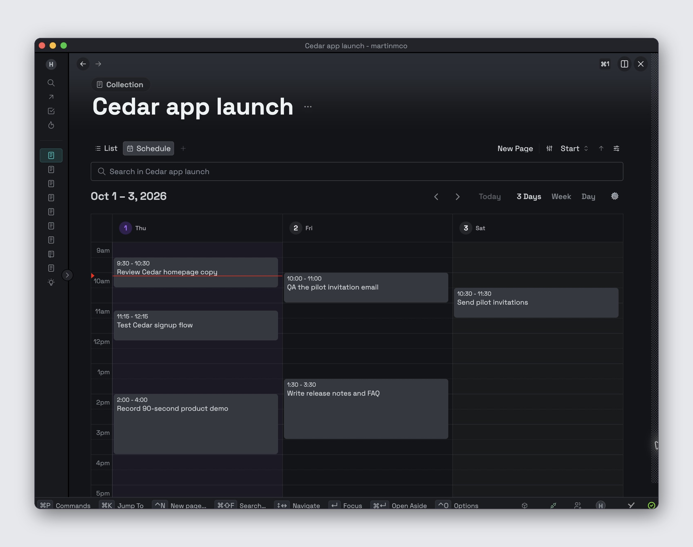

# Thymer Schedule

Schedule is a calendar view for Thymer Collections. It shows Records with Start and End dates on a time grid, where you can create events and change their times.



**I want to…** [see the functions](#functions) · [add it to a Collection](#add-schedule) · [check compatibility](#compatibility) · [inspect the code](#for-developers)

## Functions

| Function | What it does |
| --- | --- |
| Views | Show Day, a Monday–Sunday Week, or a custom span of 1–14 days. The custom span starts at three days. |
| Event editing | Create, move, and resize timed Records in 15-minute increments. Schedule saves their Start and End dates. |
| View settings | Set visible hours and the custom day count from the Schedule gear; right-click the day-span button to change its count. Hours start at 9am–6pm, and the grid fills the available height when possible. |
| Date cues | Accent today and shade Saturday and Sunday, using Thymer's current theme colors in light and dark mode. |
| Persistence | Keep the hours and day count with the Collection view; remember the selected mode and date on each device. |

## Add Schedule

1. In Thymer, create a new **global plugin** named “Schedule (add when needed)”.
2. Paste [installer/dist/plugin.js](installer/dist/plugin.js) into **Custom Code** and [installer/plugin.json](installer/plugin.json) into **Configuration**, then save both. The [v0.1.1 release](https://github.com/martinmco/thymer-schedule/releases/tag/v0.1.1) also provides the files as download assets.
3. Open the Collection that needs a calendar and run **Schedule: add to current Collection** from Thymer's command palette.

This adds Start and End fields and a Schedule view to that Collection. Other Collections are unaffected.

## Compatibility

Thymer currently provides one Collection plugin code slot. If a Collection contains unrelated custom plugin code, the installer stops and reports **merge required**. It does not install Schedule automatically in future Collections. Journal is skipped. Updating code in an existing Schedule Collection is manual in v0.1; back up its code and configuration first. All-day and recurring events are outside v0.1 scope.

Version 0.1.1 fixes the light-theme contrast issue in v0.1.0. If you installed the earlier view, back up its Collection code and configuration before replacing the view bundle; the global installer does not update existing Collections automatically.

## For developers

```sh
npm ci
npm test
npm run build
```

`plugin.js` is the Collection view source. `dist/plugin.js` is its unminified pasteable bundle, and `dist/plugin.min.js` is embedded in the global installer. `installer/plugin.js` is the installer source; `installer/dist/plugin.js` is the pasteable global plugin. Bundles are committed so installation does not require Node.js. Build scripts include this project's MIT license and FullCalendar's MIT notice in the generated view code; see [THIRD_PARTY_NOTICES.md](THIRD_PARTY_NOTICES.md).

The project layout is:

| Path | Purpose |
| --- | --- |
| `plugin.js` | Collection view source |
| `installer/plugin.js` and `installer/plugin.json` | Opt-in global installer source and configuration |
| `dist/` and `installer/dist/` | Pasteable generated bundles |
| `test/` | Focused installer tests |
| `PLAN.md` | Current status and next work |

After changing source, run `npm run build` and `npm test`, then commit any changed bundles with the source. CI repeats the build and checks that generated files match. `"private": true` in `package.json` prevents accidental npm publication; this GitHub repository is public.

No workspace IDs, API keys, or external services are needed. The plugin uses Thymer's plugin SDK and FullCalendar packages only. Thymer's plugin APIs can change; exact signatures were checked against the [official SDK](https://github.com/thymerapp/thymer-plugin-sdk/blob/6f25f1470ff1/types.d.ts) for this release.

## Configuration reference

The Collection view uses a custom view with ID `VTHYMERDAYWEEK` and label `Schedule`. A fresh installation saves:

```json
{
  "custom": { "dayWeek": { "startField": "start", "endField": "end", "defaultMinutes": 60 } },
  "views": [{ "id": "VTHYMERDAYWEEK", "type": "custom", "label": "Schedule", "opts": { "visibleStart": "09:00", "visibleEnd": "18:00", "spanDays": 3 } }]
}
```

The excerpt shows only Schedule-owned keys; the installer preserves other Collection fields, views, and configuration. If `start` or `end` is already used by an incompatible field, the installer chooses a distinct `schedule_start` or `schedule_end` ID. It does not merge another plugin's Collection code.

Creating an event makes a Thymer Record. If its dates cannot be saved, Schedule moves the incomplete Record to recoverable Trash and removes it from the grid. If a drag or resize fails, Schedule reverts the calendar interaction and attempts to restore the original Start value; check the Record dates if Thymer reports a write error. All-day and recurring events are outside v0.1 scope.

## License

MIT. FullCalendar's included packages are also MIT licensed; their notice is in [THIRD_PARTY_NOTICES.md](THIRD_PARTY_NOTICES.md).
